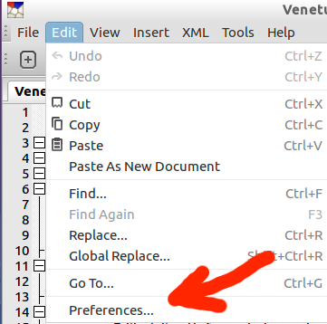
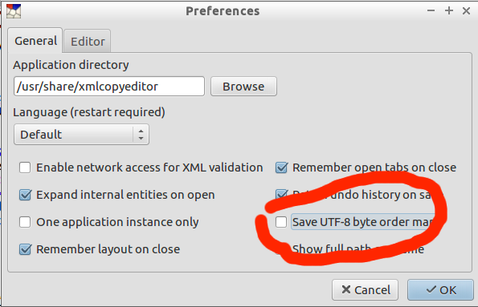

Long ago, some clever programmer had the horrible idea of inserting an invisible character at the beginning of a file to help programs guess at the way bytes are written on a computer.  You should never do this. XML Copy Editor has a setting you should check to make sure the XML files do not include this invisible character, often called the "byte order marker".

From the Edit menu, open "Preferences..."

**Uncheck** the box "Save UTF-8 byte order marker"

